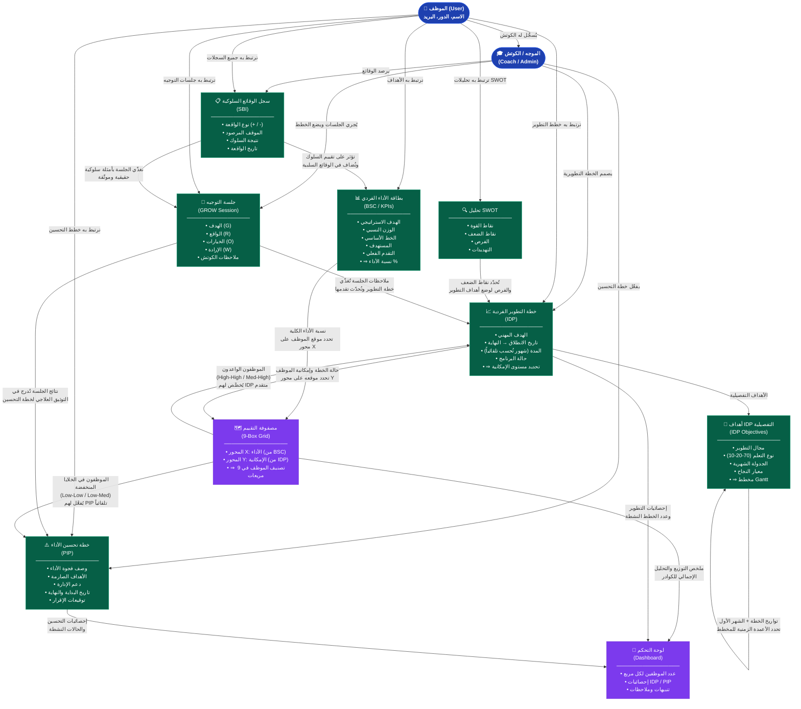
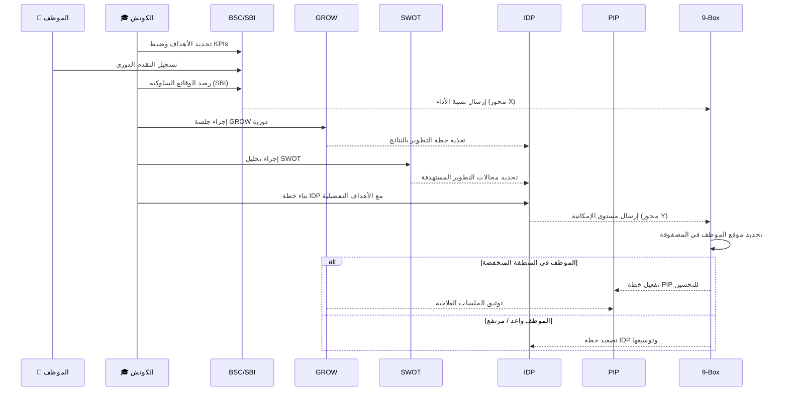

# مخطط تدفق البيانات والاعتماديات بين وحدات نظام APES

## الملخص التنفيذي

---

## شرح الاعتماديات بالتفصيل

| الوحدة | تعتمد على | تُغذّي |
|--------|-----------|--------|
| **SBI** (سجل الوقائع) | الموظف، الكوتش | GROW (أمثلة)، BSC (تأثير سلوكي) |
| **SWOT** (التحليل الرباعي) | الموظف | IDP (تحديد فجوات التطوير) |
| **BSC** (بطاقة الأداء) | الموظف، SBI | 9-Box (محور X = الأداء) |
| **GROW** (جلسات التوجيه) | الموظف، الكوتش، SBI | IDP (تحديث التقدم)، PIP (توثيق) |
| **IDP** (خطة التطوير) | الموظف، SWOT، GROW | 9-Box (محور Y = الإمكانية)، Dashboard |
| **أهداف IDP** | IDP (تواريخ البداية والمدة) | مخطط Gantt (ديناميكي بالأشهر الحقيقية) |
| **PIP** (خطة التحسين) | الموظف، 9-Box، GROW | Dashboard |
| **9-Box Grid** | BSC (أداء) + IDP (إمكانية) | PIP، IDP، Dashboard |
| **Dashboard** | جميع الوحدات | — |

---

## الدورة الكاملة (Life Cycle) للموظف في النظام

> [!NOTE]
> **الحلقة المستمرة**: النظام لا يعمل بشكل خطي بل دائري - نتائج 9-Box تُغذّي IDP و PIP، وهذه بدورها تُعدّل قراءات BSC في الدورة التالية، مما يجعل التقييم تراكمياً ومستمراً.
